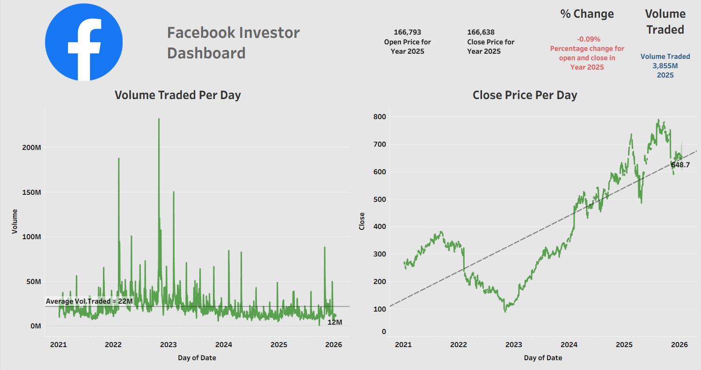

# 📈 Facebook Stock / Investor Dashboard (Tableau)

📊 An interactive **financial analytics dashboard** built using **Tableau**, designed to help investors analyze Facebook (Meta) stock performance through price trends, volume traded, and key investment metrics.

---

## 📌 Project Overview
This project is part of Facebook Stock Dashboard** from a Tableau data analytics course.  
The dashboard provides a **clear investor-focused view** of historical stock price movements and trading volume over time.

---

## 🎯 Business Objectives
- Analyze daily closing prices and long-term trends  
- Track volume traded and market activity  
- Identify overall stock performance direction  
- Support data-driven investment insights  

---

## 🧠 Key Metrics (KPIs)
- **Open Price (Year)**
- **Close Price (Year)**
- **Percentage Change**
- **Total Volume Traded**
- **Average Volume Traded**

---

## 📊 Dashboard Insights
- Daily close price trend with reference line  
- Volume traded per day with average benchmark  
- Long-term growth and volatility patterns  
- High-activity trading periods identification  

---

## 🛠 Tools & Skills Used
- Tableau Desktop  
- Google Sheets (data source)  
- Time-series analysis  
- Calculated fields  
- Reference lines & annotations  
- Dashboard design for investors  

---

### Facebook Investor Dashboard

---

## ▶️ How to Use
1. Open the Tableau workbook (`.twb`) in Tableau Desktop  
2. Ensure Google Sheet or dataset connection is active  
3. Interact with charts and trends  
4. Analyze price movement and trading volume  

---

## 🎓 Learning Outcomes
- Financial data analysis using Tableau  
- Investor-centric dashboard design  
- Time-series trend interpretation  
- Real-world stock market use case for portfolio  

---

